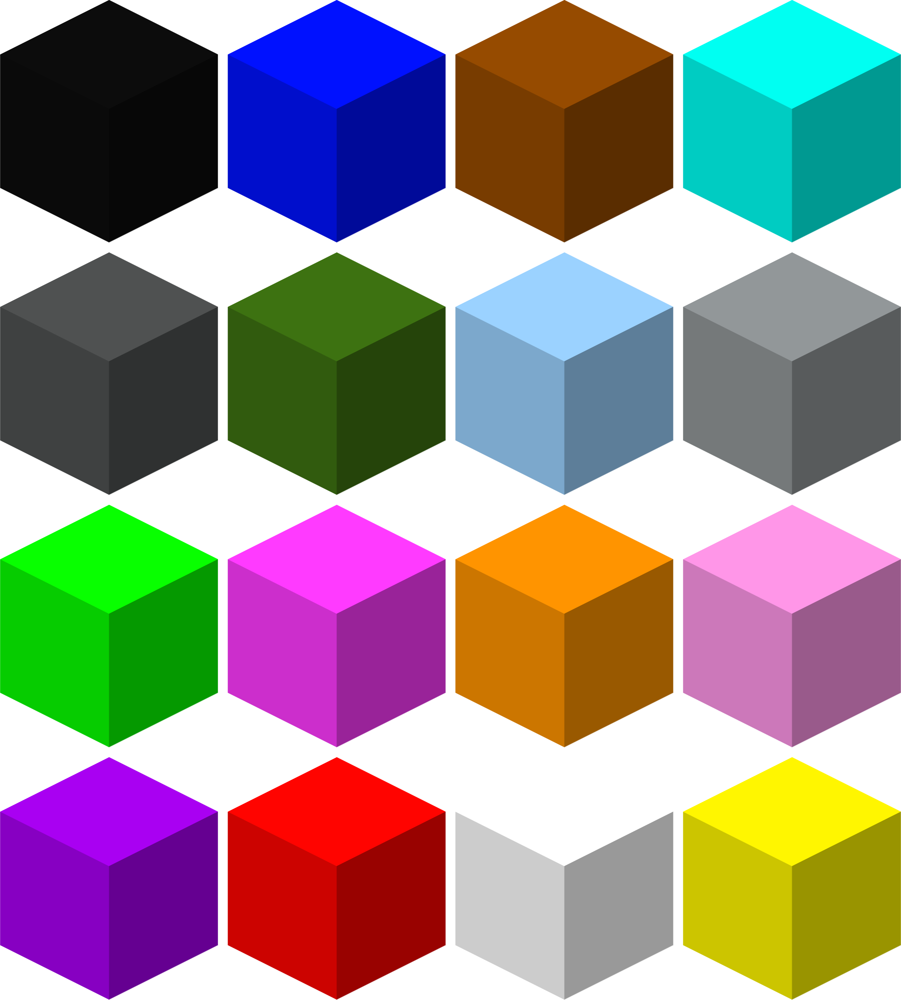
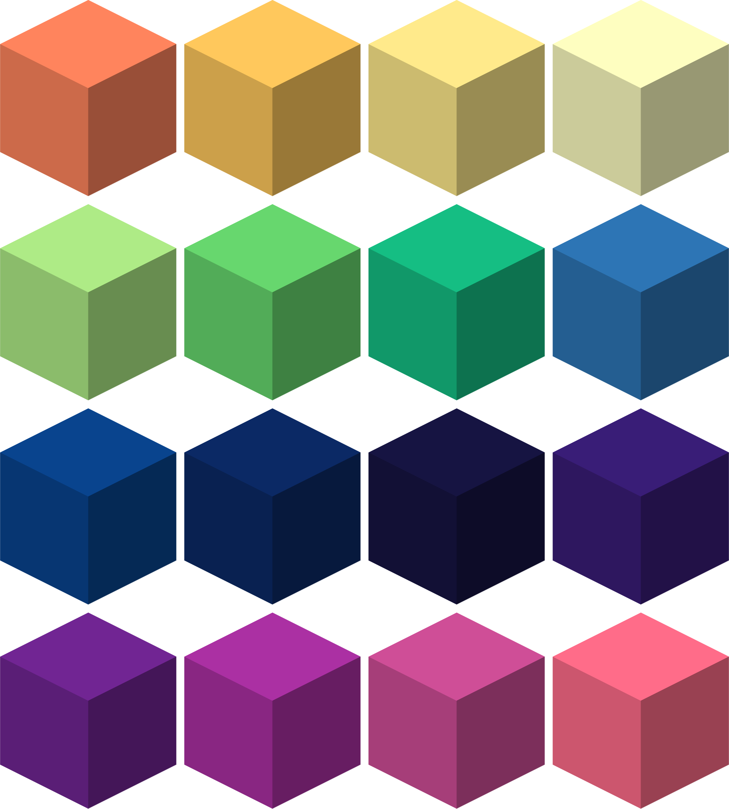

| Blackout Blocks  |   |
|------------------|------------------------------------------------------------------------------------------------------------------------------------|
| Craftable        | Yes                                                                                                                                |
| Stackable        | Yes, 64                                                                                                                            |
| Creative Tab     | Flat Lights                                                                                                                        |
| Harvest Tool     | Any                                                                                                                                |
| Blast Resistance | 100000000                                                                                                                          |
| Drops            | Itself                                                                                                                             |
| Light Level      | 7                                                                                                                                  |
| Block ID         | `flatlights:<color>_<shape>_blackout`                                                                                              |

_Note: A list of colors can be found [here](Colors). A list of block shapes can be found [here](Block-Shapes)_

The blackout variants of the various light blocks are identical in functionality, aside from having a lower light level than their non-blackout counterparts.

[[images/screenshots/blackout_blocks.png]]  
_Blackout blocks of various shapes and colors_

## Appearance
These blackout blocks look the same as their non-blackout counterparts, except they use models with normal shading instead of no shading. They emit the same light level as a redstone torch.

[[images/screenshots/blackout_block_comparison.png]]    
_A regular lime flat light block on the left, compared to the blackout lime flat light block on the right_

## Obtaining
Blackout blocks can be crafted shapelessly with any non-plated light block of choice, and blackout powder. Blackout blocks can also be found in the `Flat Lights` creative tab, or obtained through the `/give` command.

[[images/recipes/blackout_block.png]]  
*The crafting recipe for a lime blackout block*

## Usage
The flatblock blackout blocks are also tagged as `flatblock` and can thus be used to craft [prismatic blocks](Prismatic-Block).

Besides crafting uses, blackout blocks are meant to be used as decoration blocks for lighting.