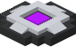

| Gravity Lift |  |
|--------------|-------------------------------------------------------------|
| Craftable    | Yes                                                         |
| Stackable    | Yes, 64                                                     |
| Creative Tab | Flat Lights                                                 |
| Item ID      | `flatlights:gravity_lift`                                   |

The gravity lift is a tool that raises the player up a certain number of blocks.

## Obtaining
Gravity lifts can be crafted using the [Spectralizer](Spectralizer), with 3 glass panes of any color, 2 iron ingots, and 1 [prisma nucleus](Prisma-Nucleus). This outputs 1 gravity lift. Gravity lifts can also be found in the `Flat Lights` creative tab, or obtained through the `/give` command.

[[images/recipes/gravity_lift.png]]  
*The crafting recipe for a gravity lift, using the Spectralizer*

## Usage
Right-clicking with a gravity lift in the main hand or offhand will throw a gravity lift entity in the direction that the player is facing. Once the gravity lift hits a block and lands on the ground, it will display a purple beam that the player can make contact with. Standing in the beam will slowly lift the player up to the top of the beam, where the player can stand still. Once at the top, the player can sneak to be launched out of the beam in the direction they are facing towards. When the gravity lift is about to expire, the beam will flash white indicating its expiration, before launching the player out forcibly. The launch will be the same as if the player chose to sneak and jump out themselves.

There is a cooldown time for using the gravity lift. The default cooldown is 5 seconds, and the default lifetime of the lift is 10 seconds. Both the lifetime of the gravity lift and the cooldown time can be changed in the config options though.

[[images/screenshots/gravity_lift.png]]     
_Using the gravity lift_

The gravity lift has no crafting uses.