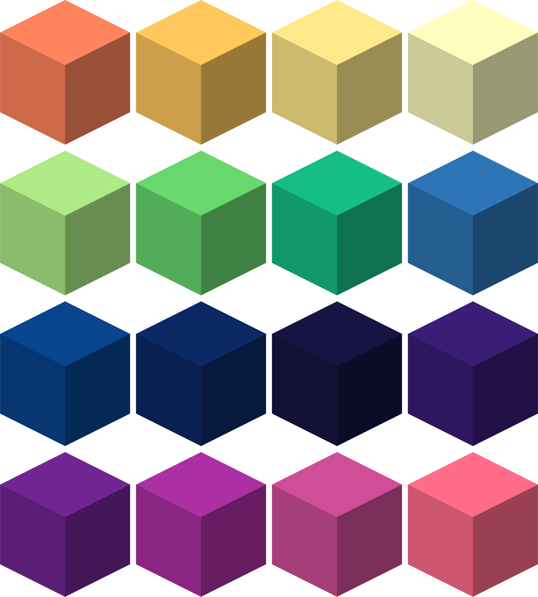
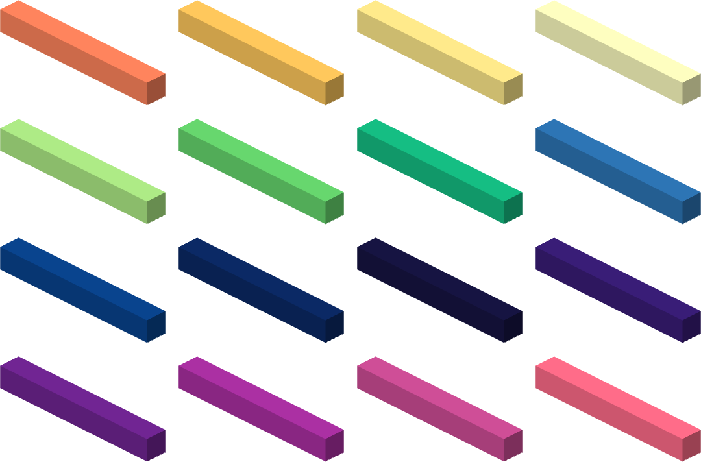
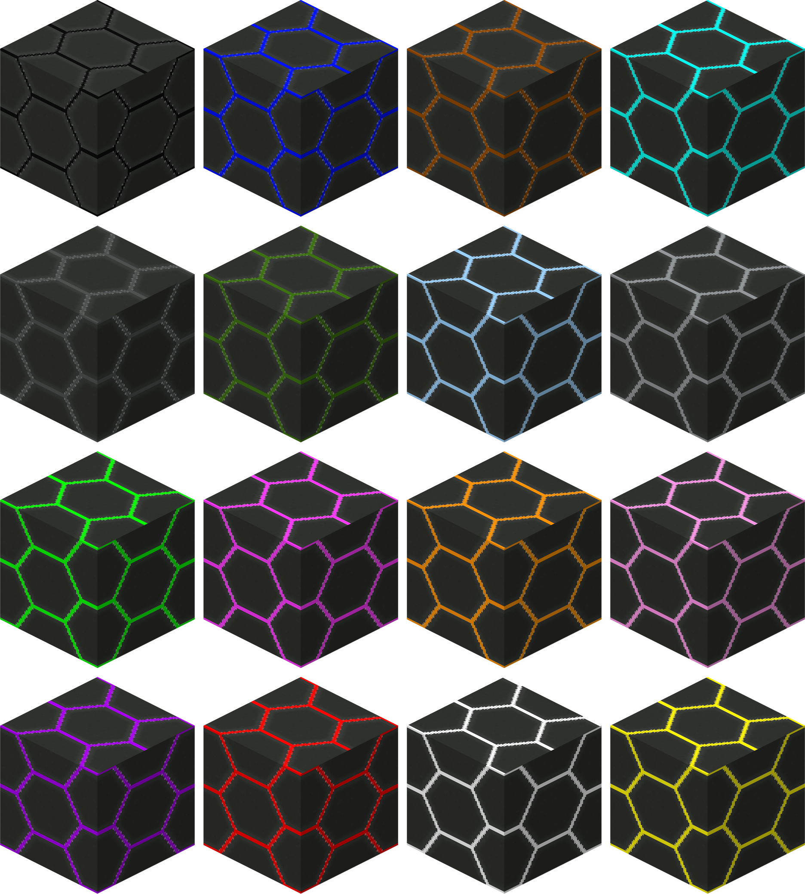
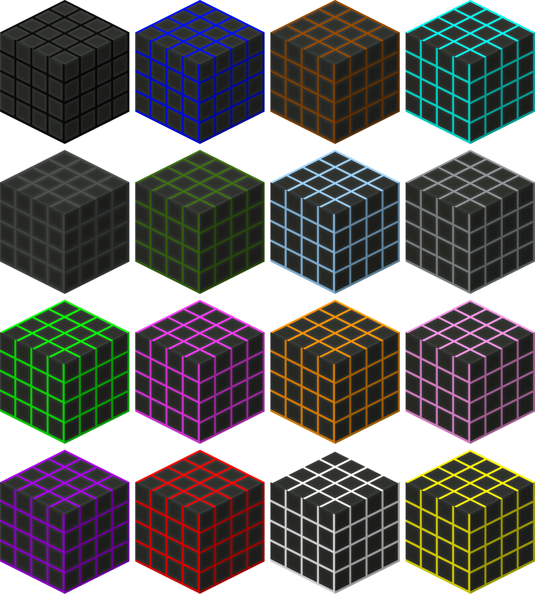

| Hue Shifted Flat Light Blocks |  |
|-------------------------------|-----------------------------------------------------------------|
| Craftable                     | Yes                                                             |
| Stackable                     | Yes, 64                                                         |
| Creative Tab                  | Flat Lights                                                     |
| Harvest Tool                  | Any                                                             |
| Blast Resistance              | 100000000                                                       |
| Drops                         | Itself                                                          |
| Light Level                   | 15                                                              |
| Block ID                      | `flatlights:<color>_flatblock`                                  |

_Note: A list of colors can be found [here](Colors)._

The hue shifted variants of the various flat light blocks are identical in functionality, it is just a visual color change.

[[images/screenshots/hue_shifted_blocks.png]]   
_Hue shifted flat light blocks of various colors_

## Appearance
These hue shifted blocks look the same as their regular, vanilla dye colored counterparts. They have entirely flat textures, with no borders or noise, which gives the blocks a seamless look when used together. Hue shifted flat light blocks emit the same light level as glowstone blocks and redstone lamps. Hue shifted flat light blocks also make use of a model that has no shading, giving them an interesting visual effect.     

| Vanilla Colors                                                          | Hue Shifted Colors                                                   |
|-------------------------------------------------------------------------|----------------------------------------------------------------------|
|       |       |
|           |           |
|          |          |
|  |  |
|    |    |
|         |         |
|   |   |
|            |            |
|      |      |

## Obtaining
Hue shifted blocks can be crafted using 8 of a single color of flat light block, and a [hue shifting vial](Hue-Shifting-Vial). This outputs 8 of the corresponding hue shifted flat light block. Hue shifted blocks can also be found in the `Flat Lights` creative tab, or obtained through the `/give` command.

[[images/recipes/hue_shifted_block.png]]  
*The crafting recipe for a sapphire flat light block*

## Usage
The flatblock hue shifted blocks are also tagged as `flatblock` and can thus be used to craft [prismatic blocks](Prismatic-Block). The hue shifted flat light blocks can also be used to craft the various [shaped](Block-Shapes.md) light blocks, in their corresponding hue shifted colors. Similarly, the hue shifted flat light blocks can also be used to craft the various [plate block](Block-Types.md) light blocks, in their corresponding hue shifted colors.

Besides crafting uses, hue shifted blocks are meant to be used as decoration blocks for lighting.