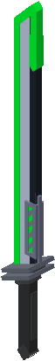

This is a list of all the items that Flat Lights adds.

## Pages in this category:
-  [[Blackout Powder | Blackout-Powder]]
-  [[Bread But High Quality | Bread-But-High-Quality]]
-  [[Curios | Curios]]
-     [[Final Sunset | Prismatic-Blademk2]]
-  [[Gravity Lift | Gravity-Lift]]
-  [[Hue Shifting Vial | Hue-Shifting-Vial]]
-  [[Jogoat | Jogoat]]
-  [[no | gun-rat]]
-  [[Portable Black Hole Generator | Portable-Black-Hole-Generator]]
-  [[Prisma Nucleus | Prisma-Nucleus]]
-  [[Prismatic Helmet Core | Prismatic-Helmet-Core]]
-  [[Prismatic Chestplate Core | Prismatic-Chestplate-Core]]
-  [[Prismatic Leggings Core | Prismatic-Leggings-Core]]
-  [[Prismatic Boots Core | Prismatic-Boots-Core]]
-  [[Prismatic Helmet | Prismatic-Helmet]]
-  [[Prismatic Chestplate | Prismatic-Chestplate]]
-  [[Prismatic Leggings | Prismatic-Leggings]]
-  [[Prismatic Boots | Prismatic-Boots]]
-  [[Prismatic Blade | Prismatic-Blade]]
-  [[Prismatic Ingot | Prismatic-Ingot]]
-  [[Prismatic Sword | Prismatic-Sword]]
-  [[Reusable Dyes | Reusable-Dyes]]
