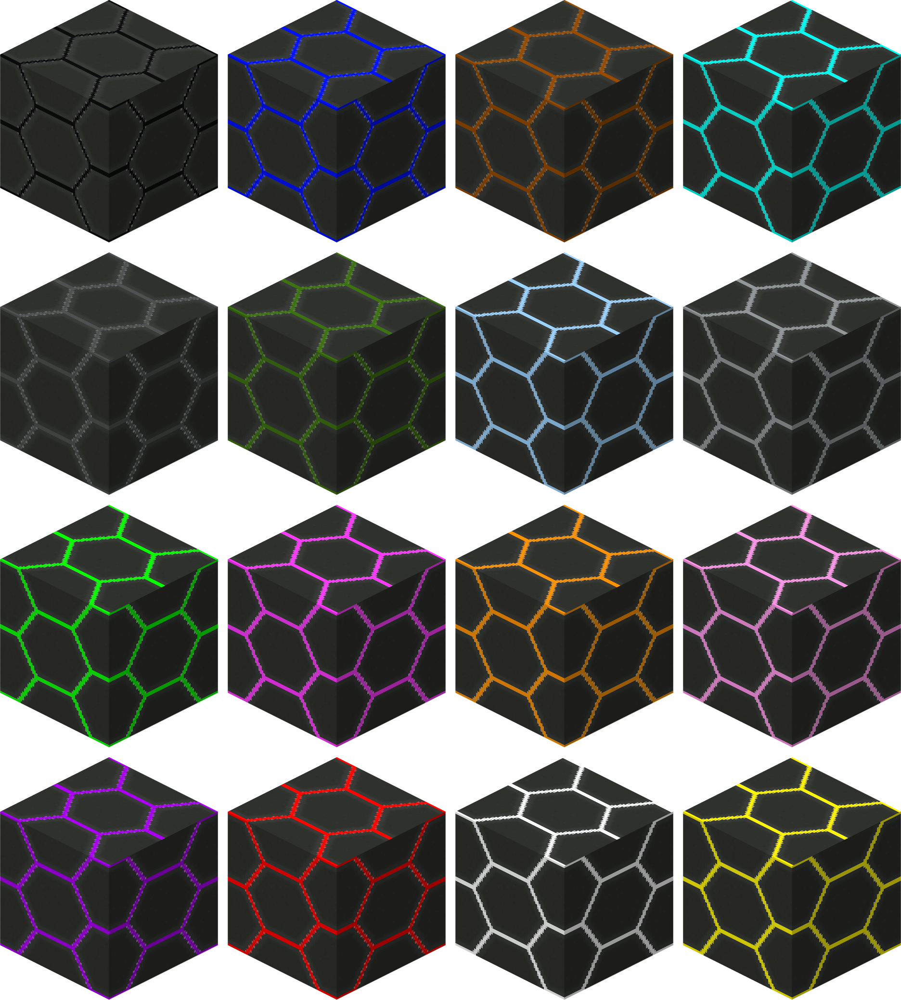

| Large Hex Light Block |  |
|-----------------------|------------------------------------------------------------------------|
| Craftable             | Yes                                                                    |
| Stackable             | Yes, 64                                                                |
| Creative Tab          | Flat Lights                                                            |
| Harvest Tool          | Pickaxe, any tier                                                      |
| Blast Resistance      | 100000000                                                              |
| Drops                 | Itself                                                                 |
| Light Level           | 10                                                                     |
| Block ID              | `flatlights:<color>_large_hexblock`                                    |

_Note: A list of colors can be found [here](Colors)._

A sturdy plated source of light. It comes in the normal 16 dye colors, as well as [hue shifted](Hue-Shifted-Blocks) variants.

[[images/screenshots/large_hexblocks.png]]    
_Large hex light blocks of various colors_

## Appearance
Large hex light blocks have a large gray hexagon pattern layered on top of the usual colors that are found in the Flat Lights blocks. As it is plated, it lets out less light than the regular [flat light block](Flat-Light-Block) would. The texture is mostly seamless, at least on one side at a time, so it can be used nicely in a floor or wall. 

## Obtaining
Large hex light blocks can be crafted using any color flat light block, and 8 iron ingots surrounding the flat light block. This will output 16 large hex light blocks of the chosen color. Large hex light blocks can also be found in the `Flat Lights` creative tab, or obtained through the `/give` command.

[[images/recipes/large_hexblock.png]]  
*The crafting recipe for a dark pink large hex light block*

## Usage
There are currently no crafting uses for large hex light blocks.

Large hex light blocks are meant to be used as decoration blocks for lighting.