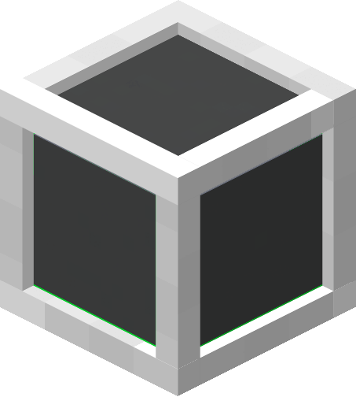

| Light Storage Block |  |
|---------------------|--------------------------------------------------------------------|
| Craftable           | Yes                                                                |
| Stackable           | Yes, 64                                                            |
| Creative Tab        | Flat Lights                                                        |
| Harvest Tool        | Any                                                                |
| Blast Resistance    | 100000000                                                          |
| Drops               | Itself                                                             |
| Tile Entity         | Yes                                                                |
| Block ID            | `flatlights:light_storage`                                         |

A sturdy storage unit block, with expanded capacity in comparison to a regular double chest.

## Appearance
Light storage blocks look like a gray and white cube, sharing textures with gray and white concrete blocks. They also have colored accents similar to the [prismatic blocks](Prismatic-Block). It has the same block size as any regular block.

## Obtaining
Light storage blocks are created in the [plating machine](Plating-Machine), just requiring a chest and a block of white concrete. This will output a single light storage block. Light storage blocks can also be found in the `Flat Lights` creative tab, or obtained through the `/give` command.

[[images/recipes/light_storage.png]]  
*The crafting recipe for a light storage block, using the plating machine*

## Usage
There are currently no crafting uses for light storage blocks.

Light storage blocks have 117 inventory slots available for storing items.

[[images/misc/light_storage_ui.png]]  
*The GUI of an empty light storage block*

Light storage blocks are meant to be used as storage replacements for chests, but can also be used as decoration due to its unique shape. When broken, it will drop all of its contents onto the ground just like a chest would.