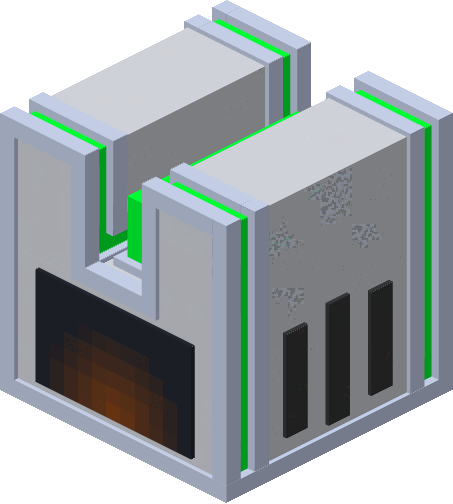

| Plating Machine  |  |
|------------------|----------------------------------------------------------------|
| Craftable        | Yes                                                            |
| Stackable        | Yes, 64                                                        |
| Creative Tab     | Flat Lights                                                    |
| Harvest Tool     | Any                                                            |
| Blast Resistance | 100000000                                                      |
| Drops            | Itself                                                         |
| Tile Entity      | Yes                                                            |
| Block ID         | `flatlights:plating_machine`                                   |

A machine that takes 2 items and combines them into a new one.

[[images/screenshots/plating_machine.png]]    
_A plating machine placed in the world_

## Appearance
The plating machine looks like a white cube with gray side accents, sharing textures with white and gray concrete blocks. The front of the plating machine has a screen texture with orange tints. It also has colored accents similar to the [prismatic blocks](Prismatic-Block). It has the same block size as any regular block.

## Obtaining
A plating machine is crafted using 2 pistons, 4 white concrete blocks, a [prismatic ingot](Prismatic-Ingot), and 1 redstone dust. This will output a single plating machine block. The plating machine can also be found in the `Flat Lights` creative tab, or obtained through the `/give` command.

[[images/recipes/plating_machine.png]]  
*The crafting recipe for a plating machine block*

## Usage
The plating machine is used to craft various other items from Flat Lights, and does not take any form of fuel or power to run. The two slots on the left of the GUI are input slots, and the slot on the right is the output item.

[[images/misc/plating_machine_ui1.png]]  
*The GUI of an empty plating machine block*

[[images/misc/plating_machine_ui2.png]]  
*The GUI of a plating machine block while creating a light storage block*

The plating machine can be used to craft a handful of items:
- [Light Storage Block](Light-Storage-Block)
- [Prismatic Blade](Prismatic-Blade)
- [Prisma Nucleus](Prisma-Nucleus)

