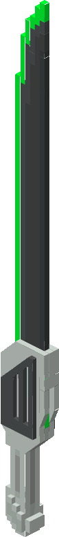

| Prismatic Blade |  |
|-----------------|-----------------------------------------------------------------|
| Craftable       | Yes                                                             |
| Stackable       | No                                                              |
| Creative Tab    | Flat Lights                                                     |
| Item ID         | `flatlights:prismatic_blade`                                    |

The prismatic blade is a sword item that deals a percent of the target's max health as bonus damage.

## Obtaining
The prismatic blade can be crafted using a [plating machine](Plating-Machine), with 1 netherite sword and 1 [prisma nucleus](Prisma-Nucleus). This outputs 1 prismatic blade. The prismatic blade can also be found in the `Flat Lights` creative tab, or obtained through the `/give` command.

[[images/recipes/prismatic_blade.png]]  
*The crafting recipe for a prismatic blade, using a plating machine*

## Usage
The prismatic blade is a weapon that deals damage to entities when the wielder left-clicks. It has a base `10 Attack Damage` and `2 Attack Speed`, making it both stronger and faster than a netherite sword. The prismatic blade also deals a percentage of the target's max health as bonus damage. The default bonus damage amount is 5% of the target's max health, but this can be changed in the config options.

As a sword item, the prismatic blade can break some blocks quicker, just like any vanilla sword.

The prismatic blade can be enchanted via an enchanting table, or by combining it with enchanted books in an anvil. It is unbreakable, so it cannot be repaired in an anvil.

The prismatic blade has no crafting uses.