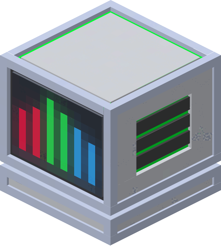

| Spectralizer     |  |
|------------------|-------------------------------------------------------------|
| Craftable        | Yes                                                         |
| Stackable        | Yes, 64                                                     |
| Creative Tab     | Flat Lights                                                 |
| Harvest Tool     | Any                                                         |
| Blast Resistance | 100000000                                                   |
| Drops            | Itself                                                      |
| Tile Entity      | Yes                                                         |
| Block ID         | `flatlights:spectralizer`                                   |

A machine that takes 6 items and combines them into a new one.

[[images/screenshots/spectralizer.png]]    
_A Spectralizer placed in the world_

## Appearance
The Spectralizer looks like a white cube with gray side vents, sharing textures with white and gray concrete blocks. The front of the Spectralizer has a screen texture with colored bars. It also has colored accents similar to the [prismatic blocks](Prismatic-Block). It has the same block size as any regular block.

## Obtaining
A Spectralizer is crafted using 3 of any glass block, 4 white concrete blocks, a [prismatic ingot](Prismatic-Ingot), and 1 redstone dust. This will output a single Spectralizer. The Spectralizer can also be found in the `Flat Lights` creative tab, or obtained through the `/give` command.

[[images/recipes/spectralizer.png]]  
*The crafting recipe for a Spectralizer*

## Usage
The Spectralizer is used to craft various other items from Flat Lights, and does not take any form of fuel or power to run. The six outer slots are input slots, and the center slot is the output item.

[[images/misc/spectralizer_ui1.png]]  
*The GUI of an empty Spectralizer*

[[images/misc/spectralizer_ui2.png]]  
*The GUI of a Spectralizer while creating a prismatic helmet*

The Spectralizer can be used to craft a handful of items:
- [Bread but High Quality](Bread-But-High-Quality)
- [Gravity Lift](Gravity-Lift)
- [Portable Black Hole Generator](Portable-Black-Hole-Generator)
- [Prismatic Helmet](Prismatic-Helmet)
- [Prismatic Chestplate](Prismatic-Chestplate)
- [Prismatic Leggings](Prismatic-Leggings)
- [Prismatic Boots](Prismatic-Boots)

