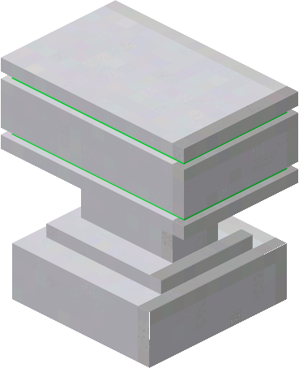

| Spectrum Anvil   |  |
|------------------|---------------------------------------------------------------|
| Craftable        | No                                                            |
| Stackable        | Yes, 64                                                       |
| Creative Tab     | Flat Lights                                                   |
| Harvest Tool     | Any                                                           |
| Blast Resistance | 100000000                                                     |
| Drops            | Itself                                                        |
| Tile Entity      | Yes                                                           |
| Block ID         | `flatlights:spectrum_anvil`                                   |

An anvil but with cheaper repair costs than a normal anvil.

## Appearance
The spectrum anvil looks like a white anvil, sharing textures with white concrete blocks. It also has colored accents similar to the [prismatic blocks](Prismatic-Block). It has the same block size as a regular anvil.

## Obtaining
There is currently no crafting recipe for the spectrum anvil, as the block is not implemented. The spectrum anvil can be found in the `Flat Lights` creative tab, or obtained through the `/give` command.

## Usage
The spectrum anvil works the same way as a normal anvil, but the repair cost caps out at a certain XP cost instead of eventually getting `Too Expensive`. Spoiler alert it doesn't actually do anything yet, but you can use it as decoration in creative mode if you want.

The spectrum anvil has no uses in crafting.

## Trivia
Don't actually try to use this, it deletes your items instead of giving them back if you exit the GUI without taking the items out of the slots again.

