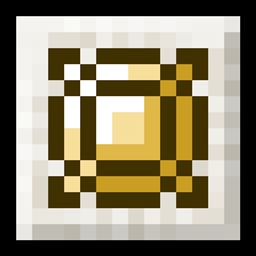

| Light Cube     |                    |
|----------------|-------------------------------------------------------------------------|
| Set Name       | [Radiance of the False Sun](Sets-And-Effects#radiance-of-the-false-sun) |
| Set Effect     | [Rising Heat](Sets-And-Effects#rising-heat)                             |
| Possible Tiers | Common, Rare, Epic, Legendary, Growth                                   |

## Effects
Provides base:  
`+2 Healing Boost`       

Multiplied by the [[tier stat multiplier | Curio-Mechanics#tier-stat-differences]] for the total stat increase ingame.

Applies effect:     
`+Potion Effect: Fire Resistance`   
`+Potion Effect: Night Vision`

### Growth Rate
How much each stat grows per growth progress point, for a `Growth` tier of this curio:

| Stat       | Growth Rate |
|------------|-------------|
| Armor      | 0.01        |

## Obtaining
This curio can be found randomly in the loot chests of naturally generated structures, such as dungeons, strongholds, and desert temples.