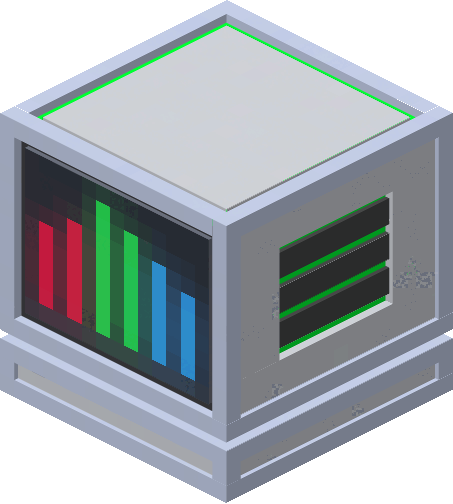
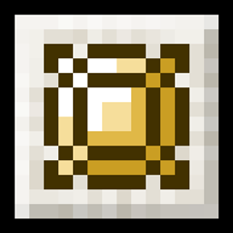

[[[images/misc/logo.png]]](https://github.com/Syi-I/FlatLights-Wiki/wiki/)
### Gameplay
 [[Blocks | Blocks]]     
[[images/gifs/prismatic_ingot.gif]] [[Items | Items]]       
 [[Enchantments | Enchantments]]  
 [[Status Effects | Status-Effects]]     
 [[Curio Mechanics | Curio-Mechanics]]

### Development
 [[Changelog | Changelog]]   
 [[About and Credits | About-And-Credits]]

### External Links
&#x2ba1;&nbsp; [Curseforge Page](https://www.curseforge.com/minecraft/mc-mods/flat-lights)